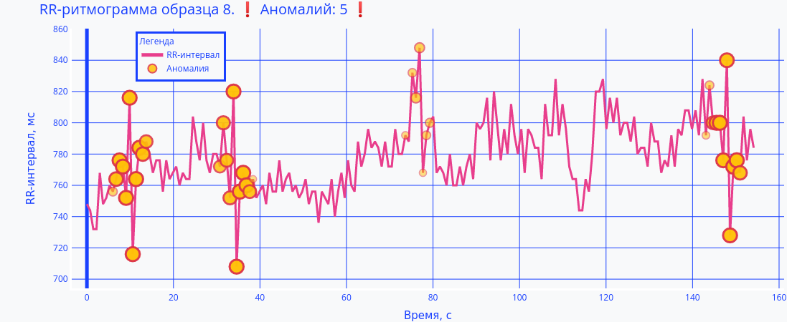

# CardioSpike

Решение кейса [CardioSpike](https://leadersofdigital.ru/event/63008/case/706486) хакатона [Цифровой Прорыв](https://leadersofdigital.ru/) команды "Звездочка", занявшее первое место.

Задача кейса состояла в детектировании аномалий в сердечных RR-ритмах, специфичных для больных COVID-19.

Пример детектирования аномалий моделью:



Состав команды: [Глеб Ерофеев](https://github.com/gleberof), [Даниил Гафни](https://github.com/danielgafni), [Сергей Фиронов](https://github.com/ifserge), [Михаил Марьин](https://github.com/muxaulmarin).

## Демонстрация
[Веб-приложение](http://сердечный-друг.рф/)

[Онлайн-документация REST API](http://сердечный-друг.рф:5000)

## Реализована функциональность
 - Разработана модель машинного обучения, позволяющая производить детектирование аномалий в RR-ритмах больных COVID-2019
 - Модель представляет собой связку градиентных бустингой и нейронных сетей, предсказания которых совмещаются при помощи линейной модели.
 - Реализована распределенная оптимизация гиперпараметров для нейронных сетей
 - Реализован REST API для детектирования аномалий
 - Реализовано веб-приложение для взаимодействия с REST API

## Особенности проекта
 - Нейронная сеть включает в себя SOTA технологию Attention
 - Система распределенного подбора гиперпараметров нейронной сети способна горизонтально расширяться практички неограниченно
 - Система обучения с использованием двойной вложенной кросс-валидации обеспечивает стабильность модели и способность корректно обобщать данные
 - Присутствуют легкие, но качественные модели LightGBM
 - Совмещение предсказания различных моделей обеспечивает дополнительную стабильность результата

## Осной стек технологий:
Python, Optuna, Hydra, Pytorch, Pytorch-Lightning, Sklearn, Pandas, Numpy, Plotly, Flask, FastAPI, Poetry, AWS

### Локальный запуск веб-приложения
Скопировать `.env.example` в `.env`:
```bash
cp .env.example .env
```
Поднять приложение:
```bash
docker-compose up
```
Оно станет доступным в браузере (по умолчанию - `localhost:8000`).

## Установка

### Установка Python нужной версии

Установить [pyenv](https://pipenv-fork.readthedocs.io/en/latest/install.html#installing-pipenv)
Следуйте инструкциям (добавить переменные в `~/.bashrc`/`~/.zshrc`)

```bash
pyenv install 3.8.6
```

### Установка проекта
Установить [poetry](https://python-poetry.org/)
```bash
poetry install
poetry run pre-commit install  # для разработки
```
Скопировать `.env.example` в `.env`:
```bash
cp .env.example .env
```

Активировать виртуальное окружение Poetry можно при помощи команды
```bash
poetry shell
```
В этом случае можно опустить `poetry run` в начале команд запуска скриптов.

## Запуск обучения нейросети
Переменные `CHECKPOINTS_DIR` и `LOGS_DIR` в файле `.env` могут указывать на `S3`, тогда при задании переменных `AWS_ACCESS_KEY_ID`, `AWS_SECRET_ACCESS_KEY` и `AWS_DEFAULT_REGION` скрипт обучения неройсети и скрипт поиска гиперпараметров будут сохранять чекпоинты модели и логи метрик на `S3`.

Запуск с параметрами по умолчанию:
```bash
poetry run cardiospike/models/cardio_net/train.py
```
Просмотр параметров запуска:
```bash
poetry run cardiospike/models/cardio_net/train.py --cfg job
```
Вывод:
```
experiment_name: CardioNet/{random_name}
win_size: 17
num_workers: 15
batch_size: 1024
patience: 40
max_epochs: 200
gpus: 1
checkpoints_dir:
- {custom_checkpoints_dir}
- /{project-dir}/data/checkpoints
logs_dir:
- {custom_logs_dir}
- /{project-dir}/data/logs
cardio_system:
  channels: 32
  top_classifier_units: 512
  rnn_units: 16
  lr: 0.001
  alpha: 0.5
  step_ahead: 6
  _target_: cardiospike.models.cardio_net.neural.CardioSystem
```
Запуск с другими параметрами:
```bash
poetry run cardiospike/models/cardio_net/train.py num_workers=8 max_epochs=10 cardio_system.channels=64
```
### Запуск поиска гиперпараметров нейросети

 Для поиска гиперпараметров необходимо также задать переменные в файле `.env` для доступа к MySQL базе, где будут сохраняться результаты экспериментов Optuna:

```dotenv
OPTUNA_HOST
OPTUNA_USER
OPTUNA_PORT
OPTUNA_PASSWORD
OPTUNA_DATABASE
```


Запуск с параметрами по умолчанию:
```bash
poetry run cardiospike/models/cardio_net/search.py
```
Просмотр параметров запуска:
```bash
poetry run cardiospike/models/cardio_net/search.py --cfg job
```
Вывод:
```
study_name: CardioNet/window=17-v2
n_trials: 100
train:
  experiment_name: CardioNet/{random_name}
  win_size: 17
  num_workers: 15
  batch_size: 1024
  patience: 40
  max_epochs: 200
  gpus: 1
  checkpoints_dir:
  - {custom_checkpoints_dir}
  - /{project-dir}/data/checkpoints
  logs_dir:
  - {custom_logs_dir}
  - /{project-dir}/data/logs
  cardio_system:
    channels: 32
    top_classifier_units: 512
    rnn_units: 16
    lr: 0.001
    alpha: 0.5
    step_ahead: 6
    _target_: cardiospike.models.cardio_net.neural.CardioSystem

```
Запуск с другими параметрами:
```bash
poetry run cardiospike/models/cardio_net/search.py n_trials=10 train.num_workers=8 train.max_epochs=10
```
